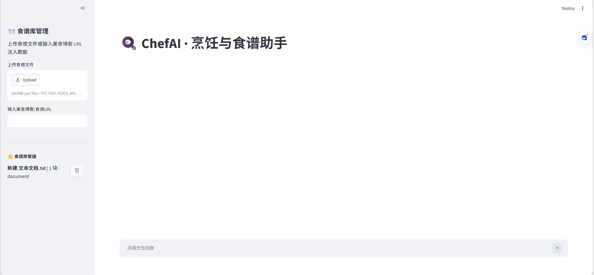
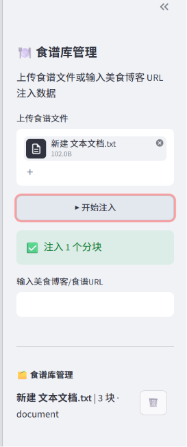
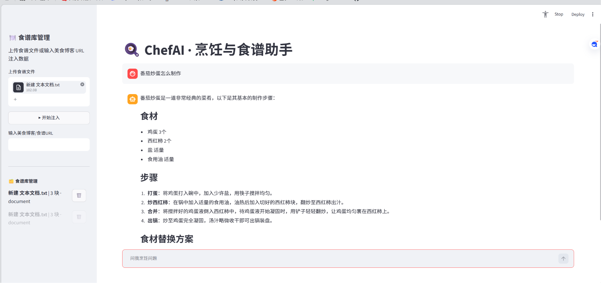

# 🍳 ChefAI —— 基于 RAG 的智能烹饪助手

> 一个结合 GLM-4、ChromaDB、Streamlit 和 RAG（Retrieval-Augmented Generation）的智能食谱问答系统。

ChefAI 可以从 PDF、图片、Excel、TXT 文档以及美食博客网页中自动提取食谱知识，并基于知识库进行检索增强问答，为用户提供个性化的烹饪建议。

---

## ✨ 项目特色

### 📚 多源食谱知识导入

支持以下数据源：

* PDF 食谱
* 图片食谱（OCR + 多模态识别）
* Excel / CSV 菜谱表格
* TXT / Markdown 文档
* 美食博客 URL

---

### 🔍 混合检索（Hybrid Retrieval）

为了提高召回效果，系统采用：

* Chroma 向量检索
* BM25 关键词检索
* Rerank 重排序
* Parent-Child 分层检索

相比单纯向量搜索，能够获得更准确的检索结果。

---

### 🧠 多轮对话记忆

ChefAI 支持：

* 用户饮食偏好记忆
* 忌口信息记忆
* 历史对话摘要压缩
* Query Rewrite（问题改写）

例如：

用户：

> 我不吃辣

后续提问：

> 推荐一道鸡肉菜

系统会自动避开辣味菜谱。

---

### 🍽️ 智能烹饪问答

支持：

* 食谱推荐
* 食材替换建议
* 烹饪步骤指导
* 菜品知识问答
* 个性化饮食建议

---

## 🏗️ 项目结构

```text
chefai/
│
├── app.py
│
├── retrieval/
│   ├── hybrid_search.py
│   ├── parent_retriever.py
│   ├── metadata_filter.py
│   └── confidence.py
│
├── memory/
│   └── conversation_memory.py
│
├── parsers/
│   ├── pdf_parser.py
│   ├── image_parser.py
│   ├── excel_parser.py
│   └── url_parser.py
│
├── vectorstore/
│   └── chroma_manager.py
│
└── evaluation/
    └── evaluator.py
```

---

## 🚀 技术栈

| 模块        | 技术                            |
| --------- | ----------------------------- |
| 大模型       | GLM-4                         |
| Embedding | 智谱 Embedding                  |
| 向量数据库     | ChromaDB                      |
| 前端框架      | Streamlit                     |
| OCR识别     | GLM-4V                        |
| 检索增强      | Hybrid Search + BM25 + Rerank |
| 会话记忆      | History Summary               |

---

## 📸 系统演示

### 首页



### 文件上传



### 对话问答



---

## ⚙️ 安装方法

### 1. 克隆项目

```bash
git clone git@github.com:Anmicius0516/ChefAI.git

cd ChefAI
```

### 2. 安装依赖

```bash
pip install -r requirements.txt
```

### 3. 配置环境变量

创建 `.env`

```env
ZHIPU_API_KEY=你的API_KEY

ZHIPU_BASE_URL=https://open.bigmodel.cn/api/paas/v4/

ZHIPU_RERANK_URL=https://open.bigmodel.cn/api/paas/v4/tools/rerank

CHROMA_DB_PATH=./chroma_db

UPLOAD_DIR=./temp_upload
```

### 4. 启动项目

```bash
streamlit run app.py
```

---

## 💡 使用示例

上传一个菜谱后提问：

```text
宫保鸡丁需要哪些食材？
```

或者：

```text
推荐一道适合减脂期的鸡肉菜谱
```

或者：

```text
我不吃辣，请推荐晚餐
```

ChefAI 将自动从知识库中检索相关内容并生成回答。

---

## 🎯 项目亮点

* 自主实现 RAG 流程
* 支持多格式知识导入
* 支持多轮对话记忆
* 支持混合检索与重排序
* 支持 OCR 与多模态解析
* 模块化工程设计

---

## 📄 License

MIT License

---

⭐ 如果这个项目对你有帮助，欢迎 Star 支持！
